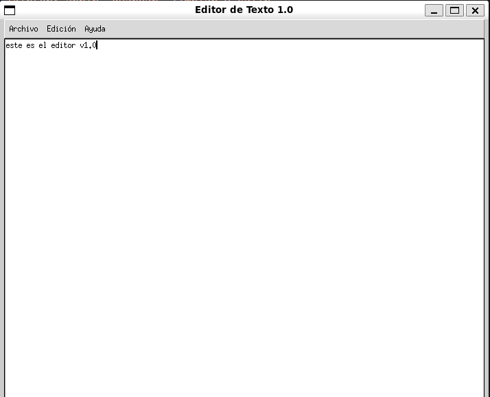

# Editor de Texto V1 - Básico

## Captura previa



Este proyecto es un **editor de texto básico** desarrollado en Python usando **Tkinter**.  
Permite escribir, limpiar, abrir y guardar archivos de texto.

## Características

- Interfaz gráfica sencilla y clara
- Abrir archivos `.txt` existentes
- Guardar archivos en `.txt`
- Limpiar el área de texto

## Requisitos

- Python 3.x
- Tkinter (incluido con Python)
- ttk (Tkinter temas)

## Cómo usarlo

1. Clona el repositorio o descarga los archivos.
2. Navega a la carpeta del proyecto:

```bash
cd ruta/a/editor_texto_v1

3. Ejecuta el editor:

python editor_texto_v1.py


4. Usa el menú "Archivo" para abrir o guardar archivos.

5. Usa el menú "Edición" para limpiar el texto.
```
